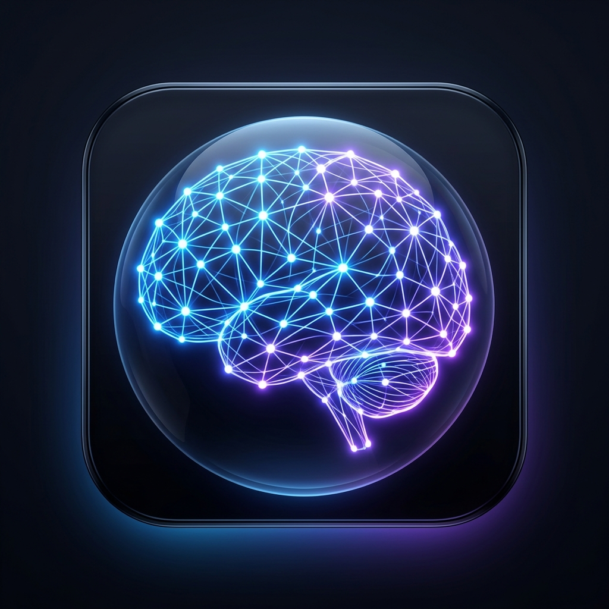

# Neural-Mesh 🧠🌐

A zero-backend, fully decentralized, cryptographic spatial mind-mapping tool. 

Neural-Mesh is designed to be the ultimate offline-first productivity tool. It runs entirely inside your browser or native desktop environment without requiring a central server, database, or API. Your data is yours.

## Features ✨

- **Spatial Mind Mapping**: Double-click anywhere to spawn thoughts. Connect them manually by holding Shift and dragging.
- **Deep Thoughts**: Every node contains a full Markdown editor. Drag and drop images, write rich text, and organize your mind.
- **Node Merging**: Drag one thought over another to fuse them together and consolidate your ideas.
- **Client-Side Cryptography**: Zero backends. Everything is encrypted using AES-GCM and stored securely on your machine.
- **Vault Security**: Lock individual thoughts or your entire brain using a master password.
- **True P2P Multiplayer**: Built-in WebRTC engine. Share a handshake token with a friend to instantly connect your instances. See live cursors, chat instantly, and collaborate in real-time.
- **Time-Travel**: Thoughts are automatically grouped by date. Use the Timeline Calendar to filter, explore, and jump back to past days.

## How it Works 🛠️

Neural-Mesh uses modern web primitives to achieve true decentralization:

1. **State Management**: Uses `Zustand` for state management, syncing seamlessly with React and Canvas renders.
2. **Web Crypto API**: Native `window.crypto.subtle` AES-GCM encryption ensures data never touches a server in plain text.
3. **WebRTC**: Peer-to-Peer networking established via manual SDP signaling (Handshake tokens). No WebSockets, no signaling servers.
4. **Steganography Export**: You can export your entire encrypted brain graph embedded invisibly inside a `.png` image!

## Quick Start 🚀

### Running the Web Version
1. Clone the repository: `git clone https://github.com/your-username/Neural-Mesh.git`
2. Install dependencies: `npm install`
3. Run the dev server: `npm run dev`
4. Open `http://localhost:5173`

### Building the Native macOS Desktop App
1. Ensure dependencies are installed.
2. Run the build command: `npm run electron:build`
3. The executable `.dmg` will be packaged into the `release/` folder.

## Security & Privacy 🛡️

Neural-Mesh is open-source because its security relies on mathematics, not obscurity. There is no telemetry, no tracking, and no external API calls (other than public STUN servers for WebRTC routing).

If you trigger **Incognito Mode**, the app will monitor window focus. The moment you switch away, Neural-Mesh triggers a **Panic Burn**, wiping all decrypted data from memory and regenerating the cryptographic salt.

## License
MIT License
